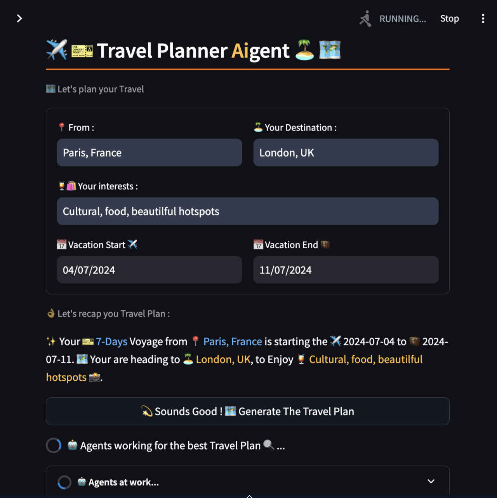

# 🏝️ Travel Planner Crew AI Agents - Streamlit App 🗺️
Travel Planner Crew AI Agents to Get `Travel Plan`for a specific `City`, `Travel Period`, `Interests` (From Paris to NY) 

## ✈️ Work Flow
- Ai Crew - 3 Agents :
- `Agent Travel` : Get the informations for travel and accomodations
- `Agent Guide` : Get the informations for the destination, focus on user interests
- `Agent Planner` : Plan the final Travel Plan
- LangChain, YF Tools, Groq Inference

## ✈TRAVEL PLANNER : LANGCHAIN & CREW AI
- Travel Planner assitant to help plan your travel and generate a LLM powered financial reports.

## CREW AI AGENT :
- An advanced research assistant by leveraging LangChain-powered tools into a CrewAI-powered multi-agent setup.
- LangChain is a framework enabling developers to easily build LLM-powered applications over their data; it contains production modules for indexing, retrieval, and prompt/agent orchestration.
- A core use case is building a generalized QA interface enabling knowledge synthesis over complex questions.
- Plugging a LangChain RAG pipeline as a tool into a CrewAI agent setup enables even more sophisticated/advanced research flows

## ✈️ Run the App
- Fork or Clone the Repo
- Get and Put your `GROQ_API` in `.streamlit/secrets.toml`
- Run : `streamlit run main.py`
